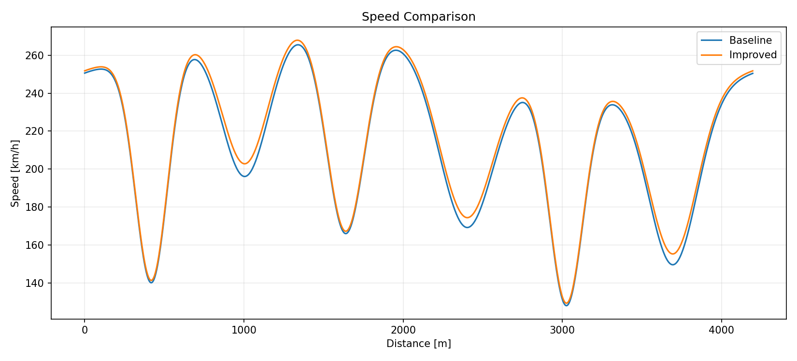
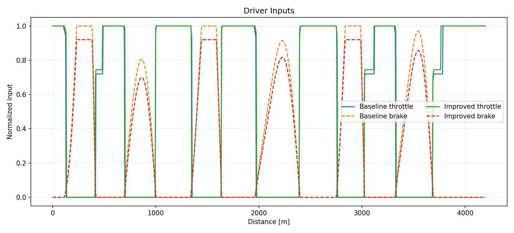
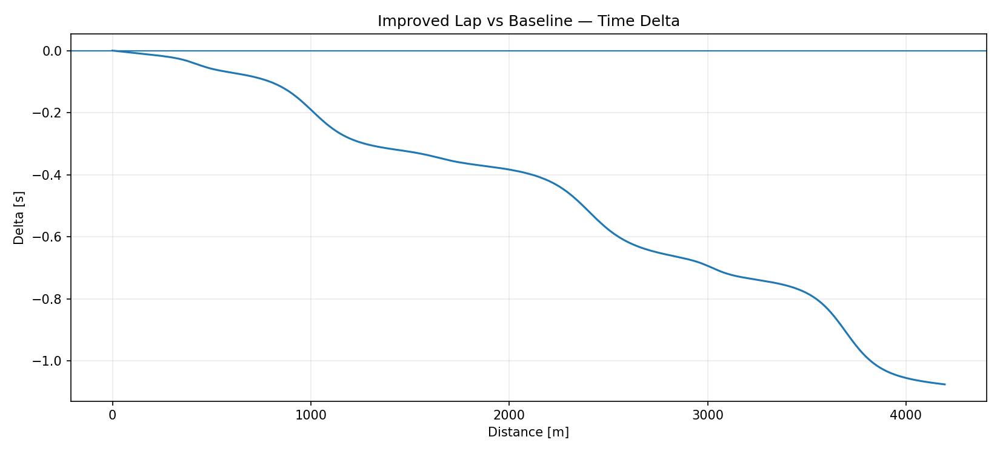

# Vehicle Telemetry Analysis Demo

[](https://github.com/migueeleflores/vehicle-telemetry-analysis-demo/actions/workflows/tests.yml)

A compact Python portfolio project for comparing two **synthetic racing laps** using telemetry-style data. It demonstrates data generation, validation, engineering metrics, lap-delta analysis, plotting, and automated tests without exposing any proprietary AC Setup AI code or datasets.

## What it demonstrates

- Python project organization
- Pandas / NumPy data processing
- Telemetry schema validation
- Physically meaningful lap-level performance metrics
- Distance-aligned time-delta calculation
- Matplotlib visualizations
- Pytest-based automated tests
- Continuous integration with GitHub Actions

## Demo pipeline

```text
Synthetic lap generation
        ↓
CSV telemetry dataset
        ↓
Schema & signal validation
        ↓
Lap metrics + time-delta analysis
        ↓
Speed / inputs / delta plots
```

## Synthetic signals

Each lap contains:

- distance
- elapsed time
- speed
- throttle
- brake
- steering angle
- gear

The dataset contains a `baseline` lap and an `improved` lap. The improved lap intentionally carries slightly more speed through selected corners so the analysis has a deterministic performance difference to detect.

## Example result

A reference run produces approximately:

| Metric | Baseline | Improved |
|---|---:|---:|
| Lap time | 73.731 s | 72.655 s |
| Average speed | 205.1 km/h | 208.1 km/h |
| Minimum speed | 127.9 km/h | 129.3 km/h |
| Maximum speed | 265.5 km/h | 267.9 km/h |

**Time gain: ~1.08 s**

Average speed is calculated from **total lap distance / total elapsed time**, rather than by averaging speed samples.

## Example outputs

### Speed comparison



### Driver inputs



### Time delta



A negative delta means the improved lap is ahead of the baseline at the same track distance.

## Project structure

```text
vehicle-telemetry-analysis-demo/
├── .github/
│   └── workflows/
│       └── tests.yml
├── README.md
├── requirements.txt
├── data/
│   └── synthetic_laps.csv
├── outputs/
│   ├── speed_comparison.png
│   ├── driver_inputs.png
│   └── delta_time.png
├── src/
│   ├── __init__.py
│   ├── generate_data.py
│   ├── telemetry_loader.py
│   ├── lap_analysis.py
│   ├── plotting.py
│   └── run_demo.py
└── tests/
    ├── conftest.py
    └── test_lap_analysis.py
```

## Run locally

Create a virtual environment:

```bash
python -m venv .venv
```

Activate the environment, then run:

```bash
pip install -r requirements.txt
python -m src.run_demo
pytest -q
```

The demo generates `data/synthetic_laps.csv` and three plots in `outputs/`.

## Data-quality checks

The loader rejects telemetry when:

- required columns are missing
- numeric values are missing
- throttle or brake leave the `[0, 1]` range
- a lap contains too few samples
- distance or elapsed time is not monotonic

## Continuous integration

GitHub Actions runs the test suite and the complete demo automatically on pushes and pull requests to `main`. This helps verify that data generation, validation, analysis, and output generation continue to work together.

## Important note

All telemetry in this repository is **synthetic**. This project is intentionally independent from the private AC Setup AI production repository and does not contain proprietary source code, real training data, model artifacts, setup-decision logic, or internal thresholds.

## Author

**Miguel Flores**  
Automotive Design Engineer focused on vehicle dynamics, simulation, telemetry, Python, and machine learning.
